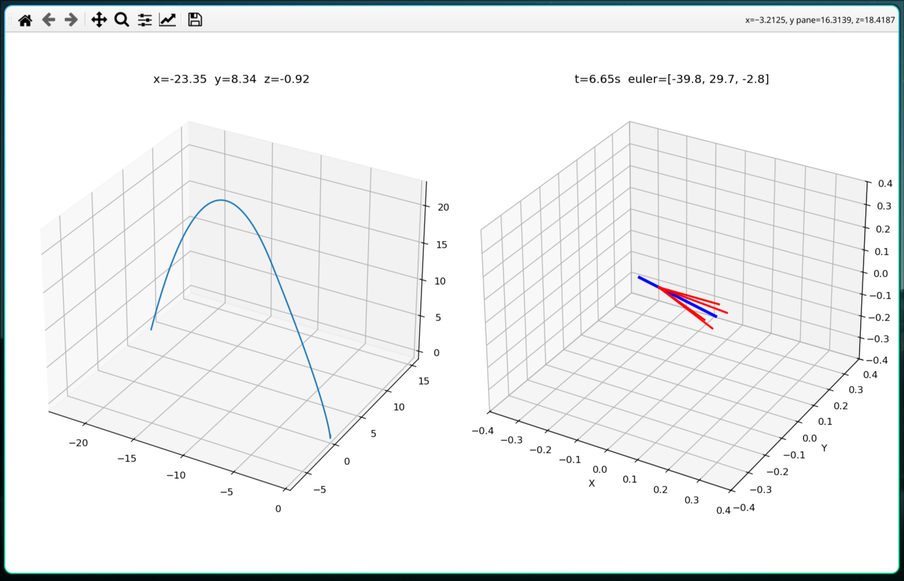
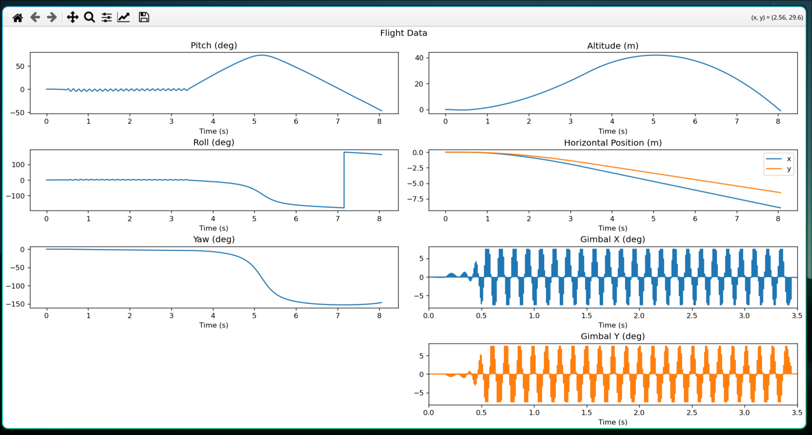

# VectorX
A 6DOF Physics Simulator designed for modeling the flight of rockets. Serves as a testing ground for active control algorithms.

## Features
 - Full 6DOF Physics modeling with orientation and physical forces
 - Custom `.eng` file reader to import thrust curves
 - Support for thrust vector control modeling
 - Variable integration timestep for simulation accuracy
 - Animated rendering using matplotlib

## TODO
 - Full hardware-in-the-loop support
 - Better rendering API(Unity Game Engine??)
 - C++/Java/C# Rewrite
